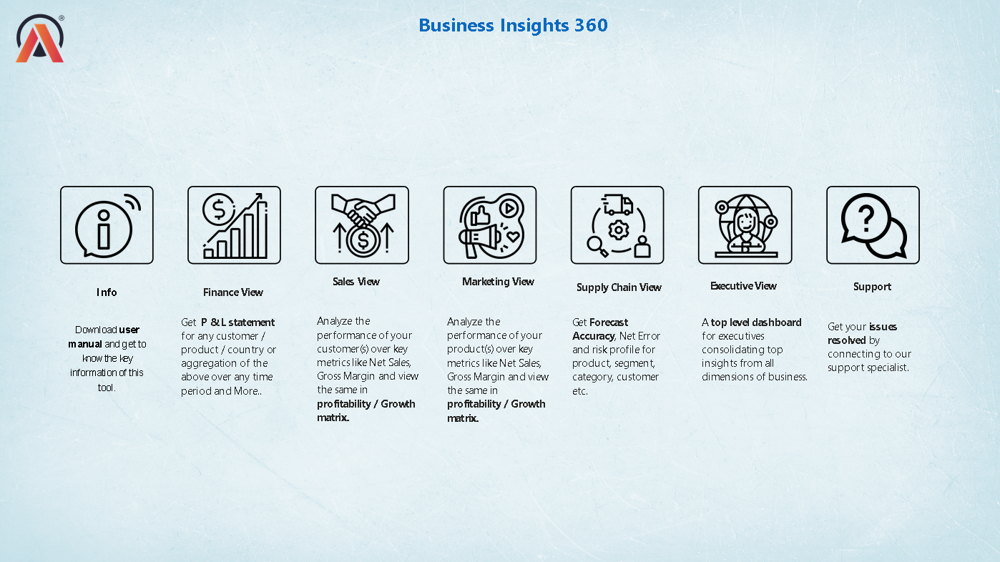
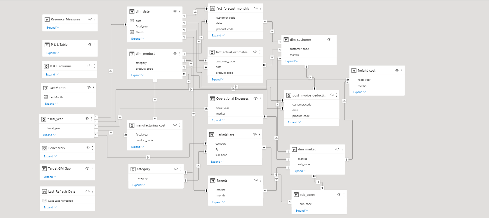

# 📊 Business Insights 360 | Power BI Dashboard


An end-to-end **Business Intelligence Dashboard** built using **Power BI** to analyze Finance, Sales, Marketing, and Supply Chain performance for **AtliQ Hardware**. This project demonstrates data modeling, DAX, KPI analysis, interactive dashboard design, and business decision-making using real-world datasets.

---

# 📌 Project Overview

AtliQ Hardware is a rapidly growing company that wanted to leverage **Business Intelligence** to make data-driven decisions across multiple business domains. This dashboard consolidates data from Finance, Sales, Marketing, and Supply Chain into a single interactive reporting solution.

The project focuses on transforming raw business data into meaningful insights through Power BI dashboards, enabling stakeholders to monitor KPIs, identify trends, and make strategic decisions.

---

# 🛠 Tech Stack

- Microsoft Power BI
- SQL
- Microsoft Excel
- Power Query
- DAX (Data Analysis Expressions)
- DAX Studio
- Power BI Desktop

---

# 📈 Key Features

- Interactive Home Dashboard
- Finance Performance Dashboard
- Sales Analytics Dashboard
- Marketing Performance Dashboard
- Supply Chain Dashboard
- Executive Overview
- KPI Cards
- Dynamic Filtering using Slicers
- Drill-down Analysis
- Bookmark Navigation
- Interactive Buttons
- Responsive Dashboard Design
- Conditional Formatting
- Interactive dashboard with multiple business views

---

# 📊 Dashboard Pages

### 🏠 Home Dashboard

The landing page provides navigation to all dashboards using interactive buttons.



---

### 💰 Finance Dashboard

Monitor revenue, gross margin, net profit, and other financial KPIs.


---

### 📈 Sales Dashboard

Analyze customer performance, product sales, regional sales, and revenue trends.


---

### 📣 Marketing Dashboard

Track marketing effectiveness, profitability, customer segments, and business performance.


---

### 🚚 Supply Chain Dashboard

Monitor forecast accuracy, inventory trends, and supply chain performance.


---

# 🗂 Data Model

The dashboard follows the **Snowflake Schema**, enabling efficient relationships and optimized report performance.



---

# 📂 Dataset Overview

The project utilizes multiple **Fact** and **Dimension** tables.

### Dimension Tables

- Customer
- Product
- Market

### Fact Tables

- Sales
- Forecast
- Manufacturing Cost
- Freight Cost
- Gross Price
- Pre Invoice Deductions
- Post Invoice Deductions

The data is imported from SQL databases and transformed using **Power Query** before building the dashboard.

---

# 📌 Business Metrics

The dashboard analyzes several important business KPIs, including:

- Net Sales
- Gross Sales
- Gross Margin
- Net Profit
- Forecast Accuracy
- Revenue Growth
- Customer Performance
- Product Performance
- Market Performance
- Inventory Analysis

---

# 📚 Technical Skills Applied

- Data Cleaning
- Data Transformation
- Data Modeling
- Snowflake Schema
- DAX Measures
- Calculated Columns
- KPI Cards
- Dynamic Titles
- Bookmarks
- Drill-through
- Page Navigation
- Slicers
- Conditional Formatting
- Power Query

---

# 💼 Business Problem

AtliQ Hardware expanded globally without relying on advanced analytics, leading to poor decision-making and financial losses in certain markets.

This project helps stakeholders answer critical business questions related to:

- Which markets generate the highest revenue?
- Which products are most profitable?
- Which customers contribute the most sales?
- How accurate are sales forecasts?
- Where can operational costs be reduced?
- Which regions require strategic attention?

---

# 📊 Business Outcome

The dashboard enables management to:

- Monitor business performance in real time
- Improve strategic decision-making
- Identify high-performing products and markets
- Optimize supply chain operations
- Track financial health
- Analyze customer behavior
- Improve sales forecasting
- Reduce operational inefficiencies

---

# 🎯 Skills Demonstrated

- Business Intelligence
- Dashboard Design
- Data Visualization
- Data Modeling
- SQL
- Power Query
- DAX
- KPI Analysis
- Business Analytics
- Interactive Reporting

---

# 📁 Project Structure

```
Business-Insight-360
│
├── Resources
│   ├── Data_model.png
│   ├── Finance View.png
│   ├── Home.png
│   ├── Marketing View.png
│   ├── Sales View.png
│   └── Supply Chain View.png
│
├── Business Insight 360 Excel File.xlsx
└── README.md
```

---

# 📸 Dashboard Preview

| Dashboard | Description |
|------------|-------------|
| Home | Navigation Dashboard |
| Finance | Financial KPIs |
| Sales | Customer & Product Analysis |
| Marketing | Marketing Insights |
| Supply Chain | Forecast & Inventory Analysis |


---

# ⭐ If you found this project helpful, consider giving it a Star!
